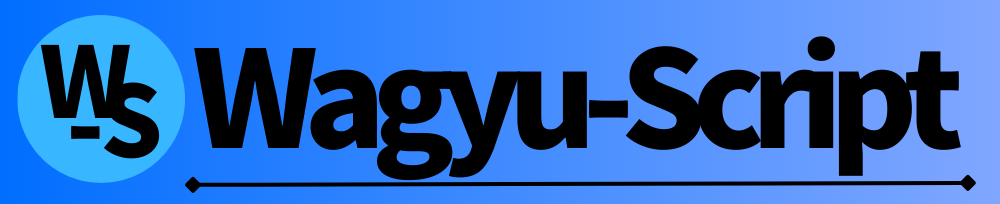

Wagyu-script
---
Wagyu-scriptは、@kurogeが開発した半角スペース区切りが特徴のシンプルなプログラミング言語です。/ Wagyu-script is a simple programming language developed by @kuroge, which is characterized by half-width space separation.

始め方など
---
詳しくは、[Get Started](./docs/ja/get-started.md)ページをご覧ください。

How to start (en)
---
Please see the [Get Started](./docs/en/get-started.md) page for more information (Used Google Translate and ChatGPT to translate).

お知らせ
---
 - 2024/08/06: Wagyu-scriptのパッケージの反映忘れが発覚したため、v1.1.0-betaより前（v1.1.0-betaは**含まない**という意味）のバージョンが非推奨となりました。

その他細かい更新内容は、[CHANGELOG.md](./CHANGELOG.md)をご覧ください。

Examples
---

### Hello, World!
```
println "Hello, World!";
```

### FizzBuzz
```
start = value 1;
end = value 100;

while #(start <= end) {
    if #(start % 15 == 0) {
        println "FizzBuzz";
    } elif #(start % 5 == 0) {
        println "Buzz";
    } elif #(start % 3 == 0) {
        println "Fizz";
    } else {
        println start;
    };

    start = add 1;
};
```